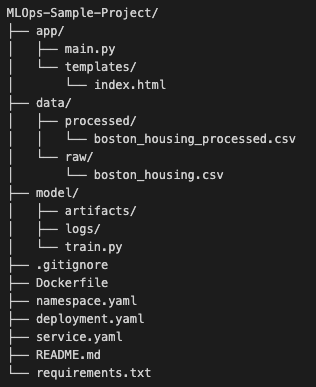

[](https://github.com/psf/black)
[](http://makeapullrequest.com)

## MLOps Sample Project 🚀
Welcome to this fantastic MLOps Sample Project! 😄 I will guide you through an end-to-end machine learning pipeline, from data preprocessing to model deployment, using MLOps best practices. Get ready to build a regression model that predicts housing prices using the classic Boston Housing dataset. 🏠

## Table of Contents 📚
Project Structure
Installation
Clone Repository
Create a Virtual Environment
Install Dependencies
Usage
Train the Model
Run the Flask App
Deploy to Production
Docker Deployment
Kubernetes Deployment
AWS Deployment
Contributing

## Project Structure 🏗️



This project structure includes the Flask app, data, model training script, Dockerfile for containerization, Kubernetes configuration files for deployment, and a README file with detailed instructions on how to use the project.


## Installation 💻
Clone Repository 📥
Clone this repository to your local machine:

```
git clone https://github.com/yourusername/MLOps-Sample-Project.git
cd MLOps-Sample-Project
```

## Create a Virtual Environment 🌐
Create a Python virtual environment to manage dependencies:

```
python3 -m venv venv
source venv/bin/activate
```
Install Dependencies 📦
Install the required Python packages:
```
pip install -r requirements.txt
```

## Usage 🎮
Train the Model 🚂
Train the regression model on the Boston Housing dataset:

```
python model/train.py
```

This will preprocess the data, train the model, and save the trained model and preprocessing pipeline artifacts to the model/artifacts directory. It will also log relevant metrics and parameters to MLflow.

## Run the Flask App 🌐
Run the Flask app to serve the trained model as an API:

```
python app/main.py
```

The app will be available at http://localhost:5001. Enter feature values in the form, and the app will predict the housing price using the trained model.

## Deploy to Production 🚢
Docker Deployment 🐳
To deploy the app to production using Docker, follow these steps:

Install Docker on your machine.

Build the Docker image:
```
docker build -t mlops-sample-project .
```
Run the docker container
```
docker run -p 5001:5001 mlops-sample-project
```

The app will be available at `http://localhost:5001`.

## Kubernetes Deployment ⚓

To deploy the app using Kubernetes, follow these steps:

[Install kubectl](https://kubernetes.io/docs/tasks/tools/install-kubectl/) and [minikube](https://minikube.sigs.k8s.io/docs/start/) on your machine.

Start a local Kubernetes cluster:

```bash
minikube start
```

Kubernetes Deployment
To deploy the app to production using Kubernetes, follow these steps:

Push your Docker image to Docker Hub. First, log in to Docker Hub:

```
docker login
```

Then, tag your image:

```
docker tag mlops-sample-project:latest <your-docker-hub-username>/mlops-sample-project:latest
```

Finally, push the image:

```
docker push <your-docker-hub-username>/mlops-sample-project:latest
```

Apply the Kubernetes configuration files to your cluster:
```
kubectl apply -f namespace.yaml
kubectl apply -f deployment.yaml
kubectl apply -f service.yaml
```
Check the status of your deployment and service:

```
kubectl -n mlops-sample-project get deployments
kubectl -n mlops-sample-project get services
```

Wait for the deployment to become available and the service to get an external IP address. Once the service has an external IP, you can access the application at http://<external-ip>/.

This setup deploys your application to a Kubernetes cluster and exposes it via a LoadBalancer service. You can further enhance this setup by configuring autoscaling, adding monitoring and logging, and using Kubernetes secrets for managing sensitive data.

AWS Deployment
To deploy the app to AWS, we'll use Amazon Elastic Kubernetes Service (EKS) to manage our Kubernetes cluster and the deployment process.

Prerequisites
Install AWS CLI and configure it with your AWS account credentials.
Install eksctl, the official CLI tool for Amazon EKS, by following the installation instructions.
Install kubectl for interacting with the Kubernetes cluster.
Create an Amazon EKS Cluster
Create a new Amazon EKS cluster using eksctl:

```
eksctl create cluster --name mlops-sample-project --region us-west-2 --managed
```

This command creates a managed Kubernetes cluster in the us-west-2 region. It might take a few minutes for the cluster to be created.

Verify that the cluster has been created and that kubectl is configured to use it:

```
kubectl config use-context mlops-sample-project.us-west-2.eksctl.io
kubectl get nodes
```

Deploy the App
Apply the Kubernetes configuration files to your cluster:

```
kubectl apply -f namespace.yaml
kubectl apply -f deployment.yaml
kubectl apply -f service.yaml
```

Check the status of your deployment and service:

```
kubectl -n mlops-sample-project get deployments
kubectl -n mlops-sample-project get services
```
Wait for the deployment to become available and the service to get an external IP address. Once the service has an external IP, you can access the application at http://<external-ip>/.

Clean Up
To delete the Amazon EKS cluster and associated resources, run the following command:

```
eksctl delete cluster --name mlops-sample-project --region us-west-2
```
This will remove the EKS cluster and all associated resources, including the deployed application.


## Contributing 🤝
Feel free to contribute by creating issues or submitting pull requests! Let's make this MLOps Sample Project the best it can be! 🎉

Remember to have fun and enjoy the MLOps journey! 🎉 😄

Introduction 🚀
Welcome to the fascinating world of Machine Learning Operations, or MLOps for short! 🌟 MLOps is a set of practices that bridge the gap between data science and software engineering, focusing on the seamless integration of Machine Learning (ML) models into production environments. With the rise of ML applications, it has become crucial to manage the end-to-end lifecycle of these models effectively. That's where MLOps comes in! 😎

MLOps is essential for a few reasons:

Reproducibility: Ensuring that ML experiments and pipelines are easily replicable, reducing the risk of inconsistencies.
Scalability: Facilitating the scaling of ML models to handle increased workloads and ensuring smooth performance.
Automation: Automating repetitive tasks, such as data preprocessing, model training, and deployment, to save time and reduce human errors.
Monitoring: Keeping track of model performance and health, allowing for timely interventions and updates when needed.
In this project, we'll take a hands-on approach to explore the world of MLOps by building a simple ML project from scratch. We'll be using the well-known Boston Housing dataset 🏘️ to predict house prices based on various features such as crime rate, the average number of rooms, and accessibility to highways.

By the end of this project, you'll have a good understanding of the MLOps lifecycle and best practices, including data preprocessing, model training, serving, and deployment using various tools such as Flask, Docker, Kubernetes, and AWS Elastic Beanstalk. Let's dive in and have some fun! 🎉

Project Setup 📁
Before we dive into the details, let's first set up our project's structure. Organizing your project files and folders in a clear and intuitive way is crucial for keeping things tidy and easy to navigate. 

Let's quickly go over the purpose of each directory and file:

app/: Contains the Flask application for serving our ML model
main.py: The main script for our Flask app
templates/: Stores the HTML templates for the app's frontend
data/: Houses the dataset and processed data files
processed/: Contains the preprocessed data
raw/: Stores the raw dataset
model/: Holds the model training script and related files
artifacts/: Stores the trained model artifacts
logs/: Contains the log files for model training
train.py: The script used for training the model
.gitignore: A file to specify which files/directories should be ignored by Git
Dockerfile: Defines the Docker container for our project
namespace.yaml, deployment.yaml, service.yaml: Kubernetes configuration files
README.md: Provides a comprehensive guide to the project
requirements.txt: Lists the project's Python dependencies

Data 📊
For this project, we'll be using the Boston Housing dataset, which is a classic dataset in the field of machine learning. It consists of information about houses in the Boston area and their corresponding prices. The dataset has 506 data points, each with 13 features and one target variable (the median value of owner-occupied homes in $1000s).

Here's a brief overview of some key features in the dataset:

CRIM: Per capita crime rate by town
ZN: Proportion of residential land zoned for lots over 25,000 sq. ft
INDUS: Proportion of non-retail business acres per town
CHAS: Charles River dummy variable (= 1 if the tract bounds the river; 0 otherwise)
RM: Average number of rooms per dwelling
The target variable we'll be predicting is the median value of owner-occupied homes in $1000s (MEDV).

Data Preprocessing 🧹
Before we start training our model, we need to preprocess our data. This usually involves cleaning the data, handling missing values, and normalizing or scaling the features to ensure that our model can learn effectively from the data. Here are the steps we'll take to preprocess the Boston Housing dataset:

Load the dataset into a pandas DataFrame
Check for missing values and handle them if necessary
Split the dataset into features (X) and target variable (y)
Perform feature scaling using sklearn's StandardScaler to standardize the features
Split the data into training and testing sets

With our data preprocessed and ready to go, we can now proceed with model training and further steps in our MLOps journey. In the upcoming sections, we'll dive deeper into model training, deployment, monitoring, and all the other essential components of a successful MLOps pipeline. Stay tuned and enjoy the ride! 🚀


Model Training 🧠
Now that our data is preprocessed and ready to go, it's time to train our machine learning model! 🎓

Choosing the Regression Model
For this project, we'll be using a regression model since our goal is to predict a continuous value (the median value of owner-occupied homes). Among various regression models, we'll opt for the Random Forest Regressor. Random Forest is a powerful ensemble learning technique that builds multiple decision trees and combines their predictions. It's a popular choice due to its ability to handle complex relationships between features and target variables, as well as its robustness to overfitting. 🌲🌲

Model Training Process
The model training process involves the following steps:

Import the necessary libraries and modules
Load the preprocessed data into a pandas DataFrame
Split the data into training and testing sets
Initialize the Random Forest Regressor model
Train the model using the training data
Evaluate the model performance on the testing data using appropriate metrics, such as R2 score and Mean Squared Error (MSE)
Tracking Experiments with MLflow 📊
While training our model, we want to keep track of various experiments, model parameters, and performance metrics. MLflow is an excellent tool for this purpose. It's an open-source platform that helps manage the end-to-end machine learning lifecycle and makes it easy to track experiments, package code into reproducible runs, and share and deploy models.

By integrating MLflow into our project, we can log parameters, metrics, and even the trained model itself. This enables us to compare different runs, select the best model, and have full transparency over our experiments. MLflow's UI also provides a visual representation of our runs, making it easier to analyze and compare different experiments.

In summary, the model training process is a vital part of our MLOps pipeline. By choosing a suitable regression model, following a systematic training process, and leveraging MLflow for tracking experiments, we set the stage for efficient model deployment and monitoring in the next steps of our journey. Let's keep going! 🚀

Model Serving 🍽️
Now that we've trained our fantastic regression model, it's time to share it with the world! To serve our model, we'll use Flask, a lightweight web framework that makes it easy to create simple web applications in Python.

Flask: A Simple Web Framework 🌐
Flask is an excellent choice for serving our model because it's beginner-friendly, has a small learning curve, and provides everything we need to expose our model as a RESTful API. By creating a Flask app, we can define endpoints that accept input data, process it using our trained model, and return predictions to the clients.

Here's a brief overview of how our Flask app works:

Import the necessary libraries and modules
Load the trained model using MLflow
Define a route for our prediction endpoint
Accept input data as JSON, preprocess it, and feed it into the model for predictions
Return the predictions as a JSON response
Flask makes it easy to serve our model and integrate it with various front-end applications, making it a popular choice for model serving.

Containerization with Docker 📦
Now that our Flask app is ready, we want to deploy it in a way that's easy to manage, scalable, and reproducible. That's where Docker comes in!

Docker is a platform that allows us to package our application and all its dependencies into a container. Containers are lightweight, portable, and can run on any system that supports Docker, making it easy to share and deploy our app across different environments.

Creating a Dockerfile 📝
To create a Docker container for our app, we'll start by writing a Dockerfile. A Dockerfile is a script that contains instructions for building a Docker image. The image includes our application code, runtime, libraries, and any other dependencies required to run the app.

In our Dockerfile, we'll:

Specify the base image (e.g., Python 3.9)
Copy our application code and files into the container
Install any required packages using pip
Define environment variables, if needed
Expose the port on which our Flask app will run
Set the entrypoint or command to run our Flask app
Building and Running the Docker Container 🏗️
Once our Dockerfile is ready, we can build the Docker image using the docker build command. This command reads the Dockerfile and creates a new image with all the specified layers.

Next, we'll run our Docker container using the docker run command, specifying the exposed port and any other required options. Our Flask app will now be running inside the container and accessible on the specified port.

Docker simplifies deployment, ensures consistency across environments, and allows us to scale our application effortlessly. It's an essential tool in our MLOps toolbox, and by combining it with Flask and our trained model, we're ready to conquer the world of machine learning! 🚀🌟

Deployment with Kubernetes 🌐
We've come a long way! Our model is trained, our Flask app is ready, and we've containerized our application with Docker. Now, it's time to deploy our app to a production environment using Kubernetes.

Kubernetes: The Container Orchestrator 🎛️
Kubernetes (K8s) is an open-source container orchestration platform that automates deploying, scaling, and managing containerized applications. It's an excellent choice for deploying our app because it offers:

Scalability: Effortlessly scale your application to meet demand.
High Availability: Minimize downtime and ensure your app is always up and running.
Self-Healing: Automatically detect and replace failed containers.
Load Balancing: Distribute traffic evenly across your app's instances.
Kubernetes Configuration Files 📁
To deploy our app using Kubernetes, we'll create a set of configuration files in YAML format. These files define various resources required to deploy and manage our app:

namespace.yaml: This file defines a namespace, which is a virtual cluster within the Kubernetes cluster. Namespaces help us to logically separate our app from other applications running in the same cluster.
deployment.yaml: This file defines a deployment, which describes the desired state for our app (e.g., the Docker image to use, the number of replicas, and any environment variables). Kubernetes ensures that the actual state of our app matches the desired state defined in the deployment.
service.yaml: This file defines a service, which is a stable IP address that exposes our app to the outside world or other parts of the cluster. Services enable load balancing and ensure that our app is accessible, even when its underlying instances change.
Deploying the App with Kubernetes 🚢
With our configuration files ready, it's time to deploy our app using the following steps:

Create a namespace by applying the namespace.yaml file: kubectl apply -f namespace.yaml
Deploy our app using the deployment.yaml file: kubectl apply -f deployment.yaml -n <namespace>
Expose our app using the service.yaml file: kubectl apply -f service.yaml -n <namespace>
Our app is now running in a Kubernetes cluster and accessible via the service's IP address or domain name.

Deployment with AWS Elastic Beanstalk 🌱
As an alternative to Kubernetes, we can also deploy our app using AWS Elastic Beanstalk. Elastic Beanstalk is a fully managed service provided by AWS that simplifies the deployment and management of web applications.

Elastic Beanstalk automatically handles capacity provisioning, load balancing, scaling, and application health monitoring. To deploy our app, we'll:

Create an Elastic Beanstalk environment.
Upload our Docker container's image or provide a link to a container registry where the image is stored.
Configure the environment with any necessary settings, such as environment variables or custom domain names.
Launch the environment, and Elastic Beanstalk will handle the rest!
Both Kubernetes and AWS Elastic Beanstalk are powerful platforms for deploying our app. Depending on your infrastructure and requirements, you can choose the one that suits your needs best. Happy deploying! 🚀🎉

Deployment with AWS Elastic Beanstalk 🌱
In this section, we'll explore another deployment option - AWS Elastic Beanstalk. It's a fully managed service provided by AWS that simplifies the deployment and management of web applications.

AWS Elastic Beanstalk: The Easy Deployment Platform 🛠️
AWS Elastic Beanstalk has several benefits that make it an attractive choice for deploying our app:

Simplicity: Just upload your code, and Elastic Beanstalk automatically handles the deployment process, scaling, and monitoring.
Customization: Easily customize the underlying infrastructure and settings of your application.
Integration: Seamless integration with other AWS services, such as RDS, S3, and more.
Deploying the App using AWS CLI 🚀
We'll use the AWS Command Line Interface (CLI) to deploy our app to Elastic Beanstalk. Follow these steps:

Install and configure the AWS CLI: Follow the official AWS CLI documentation to set up the CLI on your machine.
Create an Elastic Beanstalk application: aws elasticbeanstalk create-application --application-name <your-app-name>
Initialize an Elastic Beanstalk environment: aws elasticbeanstalk create-environment --application-name <your-app-name> --environment-name <your-env-name> --version-label <your-version-label> --solution-stack-name "64bit Amazon Linux 2 v5.4.8 running Docker"
Deploy your app: Package your Dockerfile and any necessary configuration files (e.g., Dockerrun.aws.json) into a ZIP archive, and then use the AWS CLI to upload and deploy the archive to Elastic Beanstalk: aws elasticbeanstalk create-application-version --application-name <your-app-name> --version-label <your-version-label> --source-bundle S3Bucket="<your-s3-bucket>",S3Key="<your-zip-archive-key>"
AWS Elastic Beanstalk will handle the rest, deploying your app and managing its resources.

Continuous Integration and Deployment 🔄
Now that we've covered deployment options, let's dive into the world of Continuous Integration and Deployment (CI/CD).

CI/CD: The Automation Masters 🤖
CI/CD is a set of practices that involves automatically building, testing, and deploying software changes to production. Some benefits of CI/CD for MLOps include:

Faster feedback: Identify issues and bugs early in the development process.
Improved collaboration: Encourage collaboration among team members and reduce bottlenecks.
Reduced risk: Deploy smaller, incremental changes to reduce the risk of failures in production.
Setting Up CI/CD with GitHub Actions 🎬
GitHub Actions is a powerful automation tool that allows us to set up CI/CD workflows directly within our GitHub repository. Here's how to set up CI/CD for our app using GitHub Actions:

In your GitHub repository, create a new directory named .github/workflows.
Inside the workflows directory, create a new YAML file (e.g., main.yml) for your CI/CD workflow.
Define the workflow's trigger events, jobs, and steps in the YAML file. For example, you can configure the workflow to build and test your code whenever changes are pushed to the repository, and then deploy the app to Kubernetes or AWS Elastic Beanstalk if the build and tests are successful.
With CI/CD set up, you'll be able to streamline your MLOps workflow, ensuring your app is always up-to-date and running smoothly! 🌟🙌

Monitoring and Logging 📊📝
In this section, we'll delve into the importance of monitoring and logging in MLOps and the tools we used in this project.

Why Monitoring and Logging Matter in MLOps 🔍
Monitoring and logging are essential aspects of MLOps because they help:

Identify potential issues early: Detect bugs and performance issues before they impact users.
Improve performance: Analyze logs and metrics to find opportunities for optimization and efficiency gains.
Maintain reliability: Ensure your application runs smoothly by monitoring its health and performance.
Facilitate debugging: Quickly investigate and resolve issues by having access to detailed logs.
Tools for Monitoring and Logging 🛠️
In this project, we used the following tools for monitoring and logging:

MLflow: Track experiments, store model artifacts, and log metrics and parameters during model training.
Flask: Log requests and responses when serving the model.
Kubernetes: Monitor the health of the deployed application and collect logs from containers.
AWS Elastic Beanstalk: Monitor application performance, health, and logs using the AWS Management Console.
Scaling and Automation 🚀🤖
Now, let's discuss the importance of scaling and automation in MLOps and how Kubernetes and AWS Elastic Beanstalk help with these tasks.

Scaling and Automation: The Power Duo ⚡
Scaling and automation are crucial for MLOps because they:

Handle increasing workloads: Ensure your application can support growing numbers of users and requests.
Improve resource utilization: Optimize the use of resources, such as CPU and memory, based on demand.
Enhance productivity: Automate repetitive tasks, freeing up time for more valuable work.
Reduce human error: Minimize the chance of mistakes by automating processes.
Kubernetes and AWS Elastic Beanstalk: Scaling Superheroes 🦸
Kubernetes and AWS Elastic Beanstalk help scale our project by:

Kubernetes: Automatically scale the number of replicas based on resource usage and custom metrics. Kubernetes also handles load balancing across replicas to distribute traffic evenly.
AWS Elastic Beanstalk: Automatically scale instances and resources based on predefined rules or schedules. Elastic Beanstalk also provides load balancing and auto-scaling capabilities out-of-the-box.
Automating Model Retraining 🔄
To automate model retraining, you can use scheduled jobs or event-driven triggers. For example, set up a cron job to retrain your model every 24 hours or trigger retraining based on a specific event, like a significant change in data.

Conclusion 🎉
In this blog post, we've covered various aspects of MLOps, including project setup, data preprocessing, model training, model serving, containerization, deployment, CI/CD, monitoring, logging, scaling, and automation. We built a simple ML project using the Boston Housing dataset and explored different tools and techniques for implementing MLOps best practices.

We encourage you to try out this project and experiment with different tools and techniques to enhance your understanding of MLOps. Remember, the MLOps journey is all about continuous learning and improvement! 🌟🚀 Good luck, and have fun! 😄

